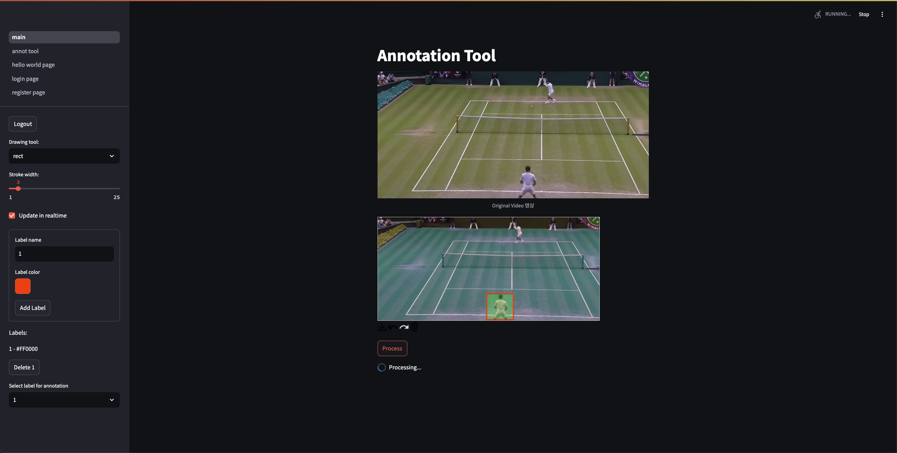

# Vvannot - Video Object Annotation Tool

**Vvannot** is an open-source video object tracking annotation tool.

## Main Page


## Result Example


## Usage Method
1. Web Platform : Streamlit
2. Human Detection : Yolov8
3. Human Tracking : DeepSort
4. Human Segmentation : SAM2 basemodel

## Installation Requirements
1. Navigate to the `vvannot` directory:
   ```bash
   cd vvannot
   ```

2. Create a new Conda environment:
   ```bash
   conda create -n {env_name} python=3.8
   ```

3. Activate the environment:
   ```bash
   conda activate {env_name}
   ```

4. Install dependencies:
   ```bash
   pip install -r requirements.txt
   ```

## Running the Application

To start the Streamlit app, use the following command:

```bash
streamlit run app/main.py
```

### Important Directories:
- **Upload Directory**: `pages`
- **Save Directory**: `annotations/{video_name}.mp4`
- **Weight Directory**: `weights/{weight}.pth`
- **Annotation Directory**: `app/annotations/{video_name}.json`

## Usage Guide

1. **Register your account**
2. **Upload a video**
3. **Annotate objects** using bounding boxes

## File Structure

```bash
vvannot/
│
├── app/
│   ├── annotations/
│   ├── main.py
│   ├── utils/
│   └── ...
├── img/
│   ├── mainpage.png
│   └── demo_example.gif
├── pages/
├── weights/
├── requirements.txt
└── README.md
```

- **app/**: Contains the main application files including annotations and utility scripts.
- **img/**: Stores images and demo GIFs for the README.
- **pages/**: Directory for uploading video files.
- **weights/**: Stores model weight files (.pth).
- **requirements.txt**: Lists the required Python packages.
- **README.md**: Project documentation file.

## Contribution Guidelines

Feel free to submit issues, requests, or pull requests to contribute to Vvannot.

---
